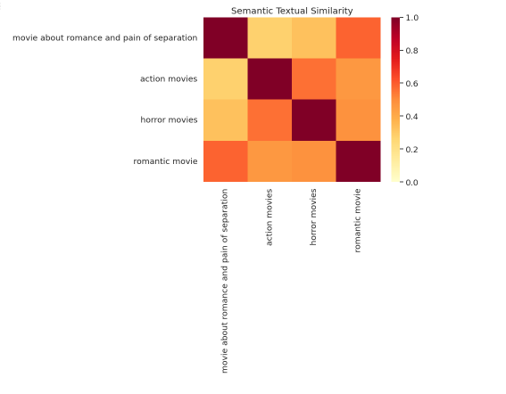

# Semantic Search with Universal Sentence Encoder (USE) and Sentence-BERT (SBERT) using Faiss

## Project Overview

This project demonstrates semantic search using two popular sentence embedding models, Universal Sentence Encoder (USE) and Sentence-BERT (SBERT), with the Faiss library for efficient similarity search. The goal is to retrieve relevant movie information based on user queries.

## Dependencies

- [TensorFlow](https://www.tensorflow.org/)
- [TensorFlow Hub](https://www.tensorflow.org/hub)
- [Sentence-Transformers](https://www.sbert.net/)
- [Faiss](https://github.com/facebookresearch/faiss)
- [Pandas](https://pandas.pydata.org/)
- [Matplotlib](https://matplotlib.org/)
- [Seaborn](https://seaborn.pydata.org/)
- [NumPy](https://numpy.org/)
- [TextBlob](https://textblob.readthedocs.io/)

## Installation

Install the required Python packages by running:

```bash
pip install tensorflow tensorflow-hub sentence-transformers faiss-gpu pandas matplotlib seaborn numpy textblob
```

# Usage

## USE-based Semantic Search:

1. Run `semantic_search_USE.ipynb`.
2. The notebook loads the Universal Sentence Encoder model, processes the movie dataset, performs semantic search using USE, and saves the Faiss index.

## SBERT-based Semantic Search:

1. Run `semantic_search_SBert.ipynb`.
2. The notebook loads the Sentence-BERT model, encodes the movie dataset, performs semantic search using SBERT, and saves the Faiss index.

## Querying the Index:

- After creating the Faiss indexes, you can query them using `query_USE.ipynb` for USE or `query_SBert.ipynb` for SBERT.
- Provide a query, and the system will return the top-k relevant movie titles based on semantic similarity.

# Data

The project uses the `wiki_movie_plots_deduped.csv` dataset available on kaggle [wikipedia-movie-plots](https://www.kaggle.com/datasets/jrobischon/wikipedia-movie-plots), which contains information about movie titles and their corresponding plots.

# Results

## USE-based Semantic Search

### Document Length Distribution



### Semantic Similarity Heatmap


## SBERT-based Semantic Search

### Document Length Distribution


### Semantic Similarity Heatmap


# Conclusion

This project showcases the power of semantic search using state-of-the-art sentence embedding models. By leveraging USE and SBERT, combined with Faiss for efficient similarity search, we can retrieve relevant movie information based on user queries.

Feel free to explore and experiment with different queries and models to observe variations in semantic search results.
